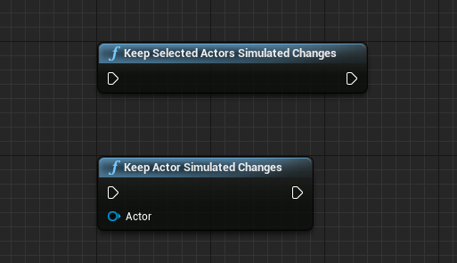
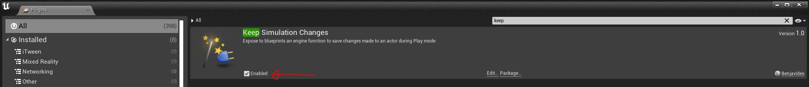
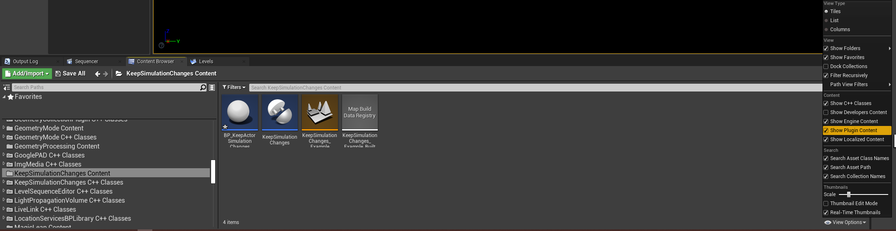

# README
> Unreal Engine plugin to expose an engine function to save the changes made to an actor in blueprints. Tested in Unreal 4.27.2. 

# Setup
> A precompiled version for Unreal 5.0.3 is avaliable in the releases section of the repo.

1. Put the `KeepSimulationChanges` folder in either

   a. Your project's `Plugins` folder. 

   b. Your engine's Plugins folder `...\Epic Games\UE_4.27\Engine\Plugins`

2. Start the project, enable the plug-in and restart

# Usage

In any blueprint add the exposed nodes

- Keep Actor Simulated Changes: Will only save the settings of the specified actor.
- Keep Selected Actors Simulated Changes: Will save the settings of all the actors selected in the editor Hierarchy. It's Unreal's default behavior when pressing "k" in Play mode.

OR

Add the `KeepSimulationChanges` component to any actor and it will save the simulated changes `OnEndPlay`

# Examples

In the Content folder of the plugin there is a level showing the plug-in working.
